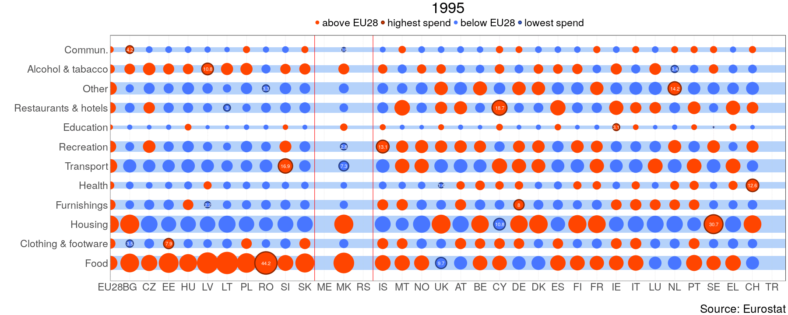

---
title: "Final consumption expenditure of households"
author: "Simona Jokubauskaite"
date: 2017-10-03T21:07:14-05:00
categories: ["eurostat"]
tags: ["R", "eurostat", "gganimate", "cowplot", "TheEconomist"]
thumbnailImagePosition: left
thumbnailImage: http://ec.europa.eu/eurostat/cache/infographs/citizenship2015/img/logoEstat.png
coverImage: ./FOTO.jpg
metaAlignment: center
disable_comments: true
output:
  blogdown::html_page:
    toc: false
    fig_width: 8
    css: "/css/my-style.css"
--- 

```{r include=FALSE, cache=FALSE}
knitr::opts_chunk$set(cache = TRUE, message = FALSE, warning = FALSE, fig.show = "animate",
                 collapse = TRUE,   collapse = TRUE, eval.after = 'fig.cap')
```

[The Economist](http://www.economist.com/blogs/graphicdetail/2015/09/daily-chart-9?fsrc=scn/fb/te/bl/ed/howcountriesspendtheirmoney) and [The Economist](http://www.economist.com/blogs/graphicdetail/2015/09/daily-chart-12) [stackoverflow](http://stackoverflow.com/questions/15840926/categorical-bubble-plot-for-mapping-studies)


At first we will download two Eurostat data sets:

* nama_co3_c - Final consumption expenditure of households by consumption purpose - COICOP 3 digit - aggregates at current prices, ESA 1995.
* nama_10_co3_p3 - Final consumption expenditure of households by consumption purpose (COICOP 3 digit) ESA 2010.


```{r }
library(eurostat)
library(data.table)
library(tidyr)
library(magrittr)
library(ggplot2)
library(cowplot)
library(plyr)
library(dplyr)
library(gganimate)
```

Download data:

```{r }
data <- lapply(c("nama_co3_c", "nama_10_co3_p3"), get_eurostat)
```

The new European System of National and Regional Accounts (ESA10) was introduced in 2014. As not all the data has been converted to ESA10 and I wanted to get the maximal ammount of information, I combined both data sets:

```{r }
#ESA95
esa95 <- data.table(data[[1]])
esa95%<>%filter(unit%in%c("MIO_EUR")&(nchar(as.character(coicop))==4|coicop%in%"TOTAL"))%>%data.table
#ESA10
esa10 <- data.table(data[[2]])
esa10%<>%filter(unit%in%c("CP_MEUR")&(nchar(as.character(coicop))==4|coicop%in%"TOTAL"))%>%data.table
esa10[, unit:="MIO_EUR"]
setnames(esa10, "values", "esa10")
setnames(esa95, "values", "esa95")

dat <- merge(esa95, esa10, all=TRUE, by=intersect(names(esa95),names(esa10)))
dat[, year:=time%>%gsub("-.*", "", .)%>%as.numeric]
dat%<>%filter(year>1994&year<2016)%>%filter(!grepl("^EA|EU1|EU27", geo))%>%filter(!geo%in%c("JP", "US"))%>%data.table
```

For come countries only ESA95 was available, so it was used to calculate the final comsumption shares.

```{r}
#only one classification is available
only1 <- dat[,lapply(.SD, function(x)any(!is.na(x))), by=geo, .SDcols=c("esa95", "esa10")]
tmp <- only1[esa95==TRUE&esa10==FALSE, geo]
dat[geo%in%tmp, esa10:=esa95]

dt <- dat[coicop!="TOTAL", lapply(.SD, function(x)sum(x, na.rm=TRUE)), by=.(geo, year), .SDcols=c("esa95", "esa10")]
setnames(dt, c("esa95", "esa10"), c("s95", "s10"))
dat <- merge(dat[coicop!="TOTAL"], dt, intersect(names(dat), names(dt)),all=TRUE)
dat <- dat[!is.na(time)]
setnames(dat, c("esa95", "esa10"), c("v95", "v10"))
dat[, esa95:=v95/s95]
dat[, esa10:=v10/s10]
dat <- dat[order(geo, coicop, year)]
```

Extrapolating shares for missing ESA10 entries:

```{r}
fill_miss_dat <- function(datnd){
  datno <- datnd
  datnd <- data.table(datnd)
  datnd[,new:=esa10]
  datnd <- datnd[order(geo,coicop,year)]
  #print(paste(unique(datnd[,geo]),unique(datnd[,coicop])))
  datnd[, index:=sum(all(is.na(esa10)))]
  datnd <- datnd[index!=1, ]
  if(dim(datnd)[1]!=0){
    datnd[,index:=NULL]
    while(sum(is.na(datnd[,new]))>0){
      datnd[, lag := shift(esa95, type='lag',n = 1)]
      datnd[, lead := shift(esa95, type='lead',n = 1)]
      datnd[, lagn := shift(new, type='lag',n = 1)]
      datnd[, leadn := shift(new, type='lead',n = 1)]
      datnd[,n1:=(esa95/lead)*leadn]
      datnd[,n2:=(esa95/lag)*lagn]
      datnd[is.na(new),new:=mean(c(n1,n2),na.rm=TRUE),by=year]
    }
      datnd[,c("lag", "lead","lagn", "leadn", "n1","n2"):=NULL]
  }else{
    datnd<-datno
  }
  datnd
}

res <- ddply(dat, .(geo, coicop), fill_miss_dat)
res <- data.table(res)
res <- res[, .(geo, coicop, year, new)]
#renorm
res[, new:=new/sum(new)*100, by=.(geo,year)]
setnames(res, "new", "prc")
```

Drawing:

```{r }
eu28 <- res[geo%in%"EU28"]
eu28 <- eu28[,.(year, coicop, prc)]
setnames(eu28,"prc","eu28")
dat <- merge(res, eu28, all=TRUE, by=intersect(names(res),names(eu28)))
eul <-unique(dat[,geo])

nms11 <- c("BG","HR","CZ","EE","HU","LV","LT","PL","RO","SI","SK")
wb <- c("AL","BA","XK","ME","MK", "RS")
nms11 <- nms11[nms11%in%eul]
wb <- wb[wb%in%eul]
other <- eul[!eul%in%c(nms11,wb,"EU28")]%>%as.character

geo1 <- data.table(geo=c(nms11, wb, other, "EU28"),geo1=1:length(eul))
nmsx <- mean(c(max(geo1[geo%in%nms11,geo1]), min(geo1[geo%in%wb,geo1])))
wbx <- mean(c(max(geo1[geo%in%wb,geo1]), min(geo1[geo%in%other,geo1])))

dat%<>%filter(geo%in%eul)%>%data.table
dat[, index:=""]
dat[, minspend:=min(prc),by=.(year,coicop)]
dat[, maxspend:=max(prc),by=.(year,coicop)]
dat[prc==minspend, index:="minspend"]
dat[prc==maxspend, index:="maxspend"]
dat[prc>=eu28&index=="", index:="above"]
dat[prc<eu28&index=="", index:="below"]
dat[index%in%c("minspend","maxspend"),labels:=round(prc,1)]
dat[,radius:=sqrt(prc/pi)]

dat <- merge(dat,geo1, all=TRUE, by="geo")
coicop1 <- data.table(coicop=unique(dat[,coicop]),coicop1=1:length(unique(dat[,coicop])))
dat <- merge(dat,coicop1, all=TRUE, by="coicop")

dat[,col:=ifelse(index%in%c("maxspend","above"),"orangered","royalblue1")]
dat[,col1:=ifelse(index%in%c("maxspend"),"orangered4",ifelse(index%in%c("minspend"),"royalblue4",col))]
dat[!is.na(labels),col5:=factor(ifelse(col1%in%"royalblue4","black","white"))]
dat[,rect_st:=coicop1-sqrt(eu28/pi)/5.5]
dat[,rect_en:=coicop1+sqrt(eu28/pi)/5.5]


dic1 <- data.table(coicop=dat[, coicop]%>%sort%>%unique, name=c('Food', 'Alcohol & tabacco', 'Clothing & footware', 'Housing, fuel & utilities', 'Furnishings', 'Health', 'Transport', 'Communications', 'Recreation', 'Education', 'Restaurants & hotels', 'Other'))
dat <- merge(dat, dic1,all.x=TRUE, by="coicop")
coicop1 <- merge(coicop1,dic1, all=TRUE, by="coicop" )

dat[, size1:=radius*6,by=year]
dat[, size2:=radius*5,by=year]

c1 <-c("orangered","orangered4","royalblue1","royalblue4")
c0 <-c("orangered","royalblue1")
c2 <-c("orangered","orangered","royalblue1","royalblue1")
lab <- c("above EU28","highest spend","below EU28", "lowest spend")
```

```{r gifpict}
q <- ggplot(dat,aes(x=geo1, y=coicop1, frame=year))+geom_vline(xintercept = nmsx, colour="red")+geom_vline(xintercept = wbx, colour="red")
q <- q+geom_rect(aes(ymin = rect_st, ymax = rect_en, xmin = -Inf, xmax = Inf, frame=year), alpha = .1, fill="#b8d2fc", color=NA)
q<-q+geom_point(aes(size=size1,colour=factor(col1),fill=factor(col), frame=year),shape=21,stroke =2)
q<-q+geom_text(aes(label=labels, frame=year),size=4, color="white")
q<-q+ scale_x_continuous( expand = c(0.05,0.05), breaks =geo1[,geo1] , labels = geo1[,geo])+
  scale_y_continuous(breaks =coicop1[,coicop1] , labels = coicop1[,name])
q<-q+scale_size_identity()+xlab("")+ylab("")
q<-q+ scale_color_manual(name="", values = c1 ,labels =lab )+
    scale_fill_manual(guide="none",values=c0)+guides(color=guide_legend(override.aes=list(fill=c2)))
q1 <-q+theme_bw()+theme(legend.position = "top",plot.title = element_text(hjust = 0.5),
                        legend.key = element_rect(colour = "white"),
                        panel.grid.major.y=element_blank(),
                        panel.grid.minor.y=element_blank(), 
                        panel.grid.minor.x=element_blank(),
                        panel.grid.major.x = element_line( size=.1, color="grey" ),
                        axis.line.x = element_line(color = "white",linetype = "solid"),
                        axis.line.y = element_line(color = "white",linetype = "solid"),
                        axis.ticks.x =element_line(color = "white",linetype = "solid"),
                        axis.ticks.y =element_line(color = "white",linetype = "solid"))
gganimate(q1, file="HH_gif.gif", ani.width=1800, ani.height=720)
```



